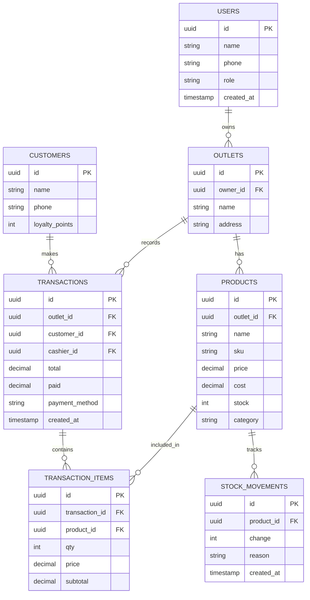

# 01 — Kasir Pintar UMKM (POS + Stok + Laporan)

Aplikasi Point of Sale (POS) sederhana untuk toko, warung, dan F&B kecil: transaksi cepat, manajemen stok otomatis, dan laporan keuangan harian yang dipahami pemilik non-teknis.

---

## 1. Analisis Pasar

**Masalah yang dipecahkan**
- Pencatatan transaksi masih manual (buku/nota), rawan salah & bocor.
- Stok tidak terpantau → barang hilang / kehabisan tanpa sadar.
- Pemilik tidak tahu untung-rugi harian secara akurat.

**Target user**
- Toko kelontong, warung makan, kedai kopi, gerai retail kecil.
- Pemilik usaha mikro 1–5 karyawan, melek HP tapi tidak melek akuntansi.

**Ukuran pasar (Indonesia)**
- 60+ juta UMKM, mayoritas masih manual. Penetrasi POS digital masih rendah.
- Tren cashless (QRIS) mendorong adopsi alat kasir digital.

**Kompetitor**
- Moka, Pawoon, Olsera, Majoo, Kasir Pintar.
- Celah: banyak yang terasa "berat", mahal untuk warung kecil, atau butuh internet stabil.

**Diferensiasi**
- **Offline-first** (jalan tanpa internet, sinkron saat online).
- Onboarding < 5 menit, antarmuka super sederhana berbahasa Indonesia.
- Harga terjangkau khusus mikro + integrasi QRIS langsung.

**Pricing**
- Free: 1 device, ≤50 produk, laporan dasar.
- Pro: Rp49–99 rb/bln per outlet (stok, multi-kasir, laporan lengkap).
- Add-on: printer thermal, scanner, integrasi QRIS dinamis.

---

## 2. Fitur Lengkap

**MVP**
- Katalog produk (nama, harga, kategori, stok, foto).
- Transaksi kasir cepat + hitung kembalian + cetak/struk digital.
- Manajemen stok otomatis (berkurang saat jual).
- Laporan penjualan harian (omzet, jumlah transaksi, produk terlaris).
- Multi-metode bayar (tunai, QRIS, transfer).

**Lanjutan**
- Multi-outlet & multi-kasir dengan peran (owner/kasir).
- Manajemen pelanggan + poin loyalitas.
- Diskon, promo, bundling, pajak/servis.
- Laporan laba-rugi & HPP, ekspor Excel/PDF.
- Integrasi marketplace & akuntansi.
- Mode offline + sinkronisasi.

---

## 3. ERD / Database



---

## 4. Wireframe

**Layar Kasir (utama)**
```
+-------------------------------------------------------+
|  [Cari produk...]                      Outlet: Warung A|
+---------------------------+---------------------------+
|  KATEGORI                 |   KERANJANG               |
|  [Semua][Makanan][Minuman]|   1x Nasi Goreng   15.000 |
|                           |   2x Es Teh         8.000 |
|  +------+ +------+ +------+|   --------------------    |
|  |Nasi  | |Es Teh| |Ayam  ||   Subtotal     31.000     |
|  |15rb  | |4rb   | |20rb  ||   Diskon            0     |
|  +------+ +------+ +------+|   TOTAL        31.000     |
|  +------+ +------+ +------+|                           |
|  |Kopi  | |Mie   | |...   ||  [ Tunai ] [ QRIS ]       |
|  +------+ +------+ +------+|  [   BAYAR & CETAK   ]     |
+---------------------------+---------------------------+
```

**Layar Laporan**
```
+-------------------------------------------------------+
|  Laporan Harian — 31 Mei 2026                         |
|  Omzet: Rp 1.250.000   Transaksi: 48   Laba: 420.000  |
|  -------------------------------------------------    |
|  Produk Terlaris:  1. Nasi Goreng (32)                |
|                    2. Es Teh (28)                     |
|  [ Grafik penjualan per jam ]                         |
|  [ Ekspor PDF ] [ Ekspor Excel ]                      |
+-------------------------------------------------------+
```

---

## 5. Prompt Coding

```text
Buatkan aplikasi POS (Point of Sale) untuk UMKM dengan stack Next.js 14 (App Router) +
TypeScript + Tailwind + shadcn/ui di frontend, dan Supabase (PostgreSQL + Auth) di backend.

Kebutuhan:
1. Skema database sesuai ERD: users, outlets, products, transactions,
   transaction_items, customers, stock_movements. Sertakan migration SQL + RLS policy
   agar tiap user hanya akses outlet miliknya.
2. Halaman kasir: grid produk dengan filter kategori, pencarian, keranjang, hitung total
   & kembalian, pilih metode bayar (tunai/QRIS), tombol "Bayar & Cetak".
3. Saat transaksi sukses: insert transaction + transaction_items dalam 1 RPC/transaction,
   kurangi stok produk, catat stock_movements.
4. Halaman katalog produk: CRUD produk (nama, sku, harga, modal, stok, kategori, foto via
   Supabase Storage).
5. Halaman laporan harian: omzet, jumlah transaksi, laba (total - HPP), produk terlaris,
   grafik penjualan per jam (gunakan recharts), ekspor PDF.
6. Offline-first: simpan transaksi di IndexedDB saat offline, sinkron otomatis saat online.
7. Auth dengan Supabase, role owner & kasir.

Berikan struktur folder, kode komponen utama, migration SQL, dan instruksi setup .env.
Pakai bahasa Indonesia untuk semua label UI. Buat UI mobile-friendly.
```

---

## 6. Roadmap MVP

| Minggu | Fokus | Output |
|--------|-------|--------|
| 1 | Setup + Auth + skema DB | Repo, login, tabel & RLS siap |
| 2 | CRUD produk + katalog | Kelola produk + upload foto |
| 3 | Layar kasir + transaksi | Jual, hitung, kurangi stok, struk |
| 4 | Pembayaran (tunai/QRIS) + laporan harian | Bisa terima bayar + lihat omzet |
| 5 | Offline-first + sinkronisasi | Jalan tanpa internet |
| 6 | Polish UI + uji 3 warung nyata | Pilot + feedback + landing page |

**Definisi selesai MVP:** seorang pemilik warung bisa input produk, melayani transaksi, dan melihat laporan harian — tanpa bantuan teknis.
