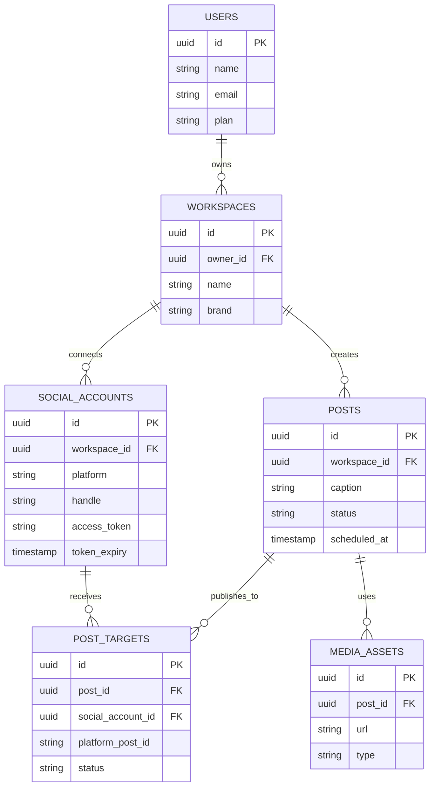

# 02 — Social Media Automation & Scheduler

Alat bantu kreator dan admin sosmed UMKM untuk membuat, menjadwalkan, dan menerbitkan konten ke banyak platform sekaligus, dilengkapi asisten AI untuk ide & caption.

---

## 1. Analisis Pasar

**Masalah yang dipecahkan**
- Posting manual di banyak platform memakan waktu & tidak konsisten.
- Sulit menjaga jadwal posting & kalender konten.
- Kehabisan ide caption / hashtag.

**Target user**
- Content creator, social media specialist, admin UMKM/online shop.
- Agensi digital marketing kecil yang mengelola banyak klien.

**Ukuran pasar (Indonesia)**
- Pengguna sosmed >160 juta; ekonomi kreator tumbuh pesat.
- Banyak UMKM jualan via Instagram/TikTok/WhatsApp.

**Kompetitor**
- Buffer, Later, Hootsuite, Vista Social, SocialPilot.
- Celah: harga global mahal (USD), kurang fokus platform lokal (TikTok-first, integrasi WhatsApp), AI caption berbahasa Indonesia.

**Diferensiasi**
- AI caption + ide konten **berbahasa & berbudaya Indonesia**.
- Fokus Instagram + TikTok + Facebook + WhatsApp Status.
- Harga Rupiah, paket agensi untuk multi-klien.

**Pricing**
- Free: 2 akun sosial, 10 jadwal/bln.
- Creator: Rp99 rb/bln (5 akun, unlimited jadwal, AI caption).
- Agency: Rp299 rb/bln (multi-brand, kolaborasi tim, approval).

---

## 2. Fitur Lengkap

**MVP**
- Hubungkan akun (Instagram, Facebook, TikTok via API resmi).
- Composer konten (gambar/video/teks) + preview per platform.
- Penjadwalan posting + kalender konten.
- AI generator caption & hashtag (bahasa Indonesia).
- Antrian + worker auto-publish.

**Lanjutan**
- Kalender konten drag-and-drop.
- Multi-brand / multi-klien (mode agensi).
- Workflow approval (draft → review → publish).
- Analytics (reach, engagement, best time to post).
- Pustaka media + template carousel.
- Repurpose 1 konten ke banyak format otomatis.

---

## 3. ERD / Database



---

## 4. Wireframe

**Composer + Scheduler**
```
+--------------------------------------------------------+
|  Buat Postingan                          [ Simpan Draft]|
+----------------------------+---------------------------+
|  Tulis caption...          |   PREVIEW                 |
|  [ ✨ Generate dgn AI ]    |   +---------------------+ |
|                            |   | [Foto]              | |
|  Platform:                 |   | @brandkamu          | |
|  [x] Instagram             |   | Caption tampil...   | |
|  [x] TikTok                |   | #hashtag #lokal     | |
|  [ ] Facebook              |   +---------------------+ |
|                            |   Tab: [IG][TikTok][FB]   |
|  Jadwal: [31 Mei] [19:00]  |                           |
|  [    JADWALKAN POSTING  ] |                           |
+----------------------------+---------------------------+
```

**Kalender Konten**
```
+--------------------------------------------------------+
|  Mei 2026          [ Minggu | Bulan ]   + Buat Konten  |
|  Sen   Sel   Rab   Kam   Jum   Sab   Min               |
|  26    27    28    29    30    31•    1                |
|              [IG]        [TT]   [IG]                    |
|              19:00       12:00  19:00                   |
+--------------------------------------------------------+
```

---

## 5. Prompt Coding

```text
Bangun aplikasi penjadwal & otomasi media sosial dengan Next.js 14 + TypeScript +
Tailwind + shadcn/ui, backend Next.js API routes + PostgreSQL (Prisma), dan worker
antrian dengan BullMQ + Redis untuk auto-publish.

Kebutuhan:
1. Skema DB sesuai ERD: users, workspaces, social_accounts, posts, post_targets,
   media_assets. Sertakan migration Prisma.
2. OAuth connect untuk Instagram Graph API, Facebook, dan TikTok. Simpan & refresh token.
3. Composer: upload media (S3/Supabase Storage), tulis caption, pilih banyak platform,
   preview per platform.
4. Tombol "Generate dengan AI": panggil OpenAI/Anthropic untuk membuat caption + hashtag
   berbahasa Indonesia sesuai brand & tujuan (jualan/edukasi/engagement).
5. Penjadwalan: simpan scheduled_at, worker BullMQ memproses antrian saat waktunya,
   publish ke tiap platform, update status post_targets.
6. Kalender konten (view bulan/minggu) dengan drag-and-drop reschedule.
7. Mode multi-workspace untuk agensi.

Berikan struktur folder, skema Prisma, kode worker, dan contoh integrasi OAuth.
UI berbahasa Indonesia, responsive.
```

---

## 6. Roadmap MVP

| Minggu | Fokus | Output |
|--------|-------|--------|
| 1 | Setup + Auth + skema DB | Repo, login, tabel siap |
| 2 | OAuth connect 1 platform (IG) | Hubungkan akun + simpan token |
| 3 | Composer + upload media | Buat draft konten + preview |
| 4 | Scheduler + worker auto-publish | Posting terjadwal otomatis |
| 5 | AI caption generator (ID) | Tombol generate caption + hashtag |
| 6 | Kalender konten + polish | Pilot ke 5 kreator + landing page |

**Definisi selesai MVP:** user bisa hubungkan IG, buat konten dengan bantuan AI caption, menjadwalkan, dan konten terbit otomatis sesuai jadwal.
