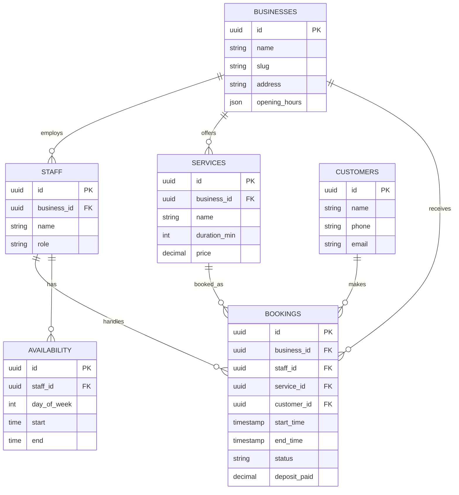

# 03 — Aplikasi Booking & Reservasi

Sistem reservasi online untuk bisnis berbasis janji temu: salon, barbershop, klinik, lab, studio, dan jasa servis. Pelanggan booking mandiri 24/7, bisnis mengelola jadwal & staf.

---

## 1. Analisis Pasar

**Masalah yang dipecahkan**
- Booking via DM/WA manual → bentrok jadwal, no-show, lupa catat.
- Pelanggan harus telepon di jam kerja saja.
- Tidak ada data pelanggan & riwayat layanan.

**Target user**
- Salon, barbershop, klinik kecantikan/gigi, fisioterapi, laboratorium, studio foto, bengkel, jasa servis rumah.

**Ukuran pasar (Indonesia)**
- Ratusan ribu usaha jasa berbasis appointment di kota-kota besar.
- Tren self-service booking meningkat pasca-pandemi.

**Kompetitor**
- Fresha, Booksy, SimplyBook.me, Treatwell.
- Celah: kebanyakan global, kurang integrasi WhatsApp untuk reminder, kurang dukungan pembayaran lokal (QRIS/DP).

**Diferensiasi**
- Reminder otomatis via **WhatsApp** (menekan no-show).
- DP / pembayaran QRIS saat booking.
- Halaman booking publik yang bisa dishare di bio Instagram.

**Pricing**
- Free: 1 staf, 1 lokasi, fitur dasar.
- Pro: Rp149 rb/bln (multi-staf, reminder WA, pembayaran).
- Komisi opsional: kecil per transaksi online.

---

## 2. Fitur Lengkap

**MVP**
- Halaman booking publik (pilih layanan → staf → slot → konfirmasi).
- Manajemen layanan (durasi, harga) & jam operasional.
- Kalender jadwal staf (cegah double-booking).
- Notifikasi/reminder via email + WhatsApp.
- Dashboard booking masuk (terima/tolak/selesai).

**Lanjutan**
- DP / pembayaran online (Midtrans/Xendit, QRIS).
- Multi-lokasi & multi-staf dengan jam berbeda.
- Database pelanggan + riwayat + catatan.
- Program loyalitas & voucher.
- Review pasca-layanan.
- Sinkron Google Calendar.

---

## 3. ERD / Database



---

## 4. Wireframe

**Halaman Booking Publik**
```
+--------------------------------------------------------+
|   Salon Cantik — Booking Online        [Login Bisnis]  |
+--------------------------------------------------------+
|  1. Pilih Layanan                                      |
|   ( ) Potong Rambut   30 mnt   Rp50.000                |
|   (•) Hair Spa        60 mnt   Rp120.000               |
|                                                        |
|  2. Pilih Staf:  [ Mbak Ani v ]                        |
|                                                        |
|  3. Pilih Tanggal & Jam                                |
|   [ 31 Mei ]  [09:00][10:00][ 11:00 ][13:00][14:00]    |
|                                                        |
|  [           LANJUT ISI DATA & BAYAR DP            ]   |
+--------------------------------------------------------+
```

**Dashboard Bisnis (Kalender)**
```
+--------------------------------------------------------+
|  Jadwal — 31 Mei 2026        [ Hari | Minggu ]         |
|        Mbak Ani        Mas Budi                        |
|  09:00 [Hair Spa  ]    [ kosong ]                      |
|  10:00 [Hair Spa  ]    [Potong - Andi]                 |
|  11:00 [ kosong   ]    [ kosong ]                      |
|  13:00 [Potong-Sri]    [Creambath]                     |
|  ----------------------------------------------------  |
|  Booking baru: 3 menunggu konfirmasi  [Lihat]          |
+--------------------------------------------------------+
```

---

## 5. Prompt Coding

```text
Buat aplikasi booking/reservasi online dengan Next.js 14 + TypeScript + Tailwind +
shadcn/ui, backend Next.js API routes + PostgreSQL (Prisma). Integrasi pembayaran
Midtrans (QRIS) dan reminder WhatsApp via API (Fonnte/Twilio/WA Cloud API).

Kebutuhan:
1. Skema DB sesuai ERD: businesses, staff, services, customers, bookings, availability.
2. Halaman booking publik per bisnis (/[slug]): pilih layanan → staf → tanggal → slot.
   Generate slot tersedia berdasarkan availability staf, durasi layanan, dan booking
   yang sudah ada (cegah double-booking, gunakan locking).
3. Form data pelanggan + bayar DP via Midtrans Snap; status booking jadi "confirmed"
   setelah pembayaran sukses (webhook).
4. Kirim konfirmasi + reminder H-1 dan H-1jam via WhatsApp.
5. Dashboard bisnis: kalender jadwal per staf (view hari/minggu), kelola layanan, jam
   operasional, daftar booking (confirm/cancel/complete), data pelanggan.
6. Auth untuk pemilik bisnis & staf dengan peran.

Berikan struktur folder, skema Prisma, logika perhitungan slot, contoh webhook Midtrans,
dan template pesan WhatsApp. UI berbahasa Indonesia, mobile-friendly.
```

---

## 6. Roadmap MVP

| Minggu | Fokus | Output |
|--------|-------|--------|
| 1 | Setup + Auth + skema DB | Repo, login bisnis, tabel siap |
| 2 | Layanan + jam + availability staf | Kelola layanan & jadwal kerja |
| 3 | Mesin slot + halaman booking publik | Pelanggan bisa pilih slot |
| 4 | Konfirmasi + dashboard kalender | Bisnis kelola booking masuk |
| 5 | Pembayaran DP (Midtrans) + reminder WA | Kurangi no-show |
| 6 | Polish + pilot 3 bisnis | Feedback + landing page |

**Definisi selesai MVP:** pelanggan bisa booking layanan + slot lewat halaman publik, bayar DP, dan bisnis melihat semua booking di kalender tanpa bentrok.
