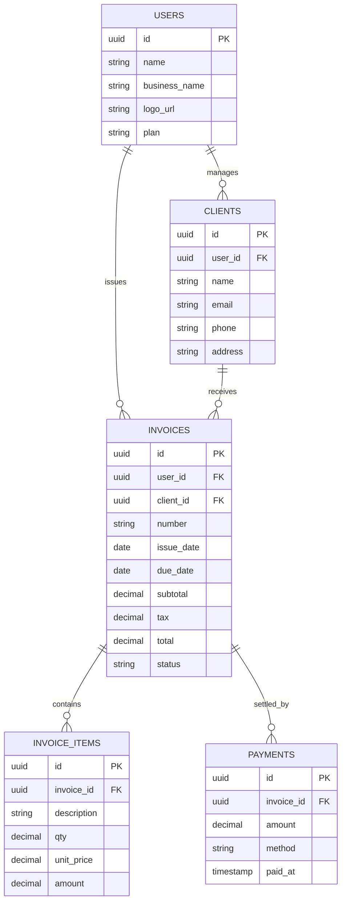

# 04 — Invoice & Penagihan Freelancer

Aplikasi pembuatan invoice profesional, pelacakan pembayaran, dan pengingat tagihan otomatis untuk freelancer dan agensi kecil di Indonesia.

---

## 1. Analisis Pasar

**Masalah yang dipecahkan**
- Invoice dibuat manual di Word/Excel → tidak rapi & lambat.
- Klien telat bayar, freelancer sungkan menagih.
- Tidak ada pencatatan arus kas & pajak.

**Target user**
- Freelancer (desainer, developer, penulis, fotografer, konsultan).
- Agensi kecil & studio kreatif.

**Ukuran pasar (Indonesia)**
- Jutaan pekerja lepas/gig; tren freelance & remote terus naik.
- Banyak yang belum pakai tools khusus.

**Kompetitor**
- Invoice Ninja, Wave, Zoho Invoice, Paper.id, Mekari Jurnal.
- Celah: kebanyakan untuk perusahaan/akuntansi penuh; freelancer butuh yang ringan + reminder otomatis + pembayaran lokal.

**Diferensiasi**
- Fokus freelancer: cepat, rapi, profesional.
- **Reminder otomatis** (email + WhatsApp) yang sopan.
- Link pembayaran (QRIS/transfer/Midtrans) langsung di invoice.

**Pricing**
- Free: 3 invoice/bln, 1 brand.
- Pro: Rp79 rb/bln (unlimited invoice, reminder, link bayar, laporan).

---

## 2. Fitur Lengkap

**MVP**
- Buat & kirim invoice (PDF + link publik).
- Kelola klien & daftar item/jasa.
- Status invoice (draft/terkirim/dibayar/jatuh tempo).
- Reminder otomatis sebelum & sesudah jatuh tempo.
- Dashboard ringkasan pendapatan.

**Lanjutan**
- Link pembayaran online (Midtrans/Xendit, QRIS).
- Invoice berulang (retainer bulanan).
- Estimasi/penawaran → konversi ke invoice.
- Multi-mata uang & pajak (PPN/PPh).
- Laporan arus kas + ekspor untuk pajak.
- Branding kustom (logo, warna).

---

## 3. ERD / Database



---

## 4. Wireframe

**Buat Invoice**
```
+--------------------------------------------------------+
|  Invoice Baru  #INV-2026-014        [Simpan] [Kirim]   |
+--------------------------------------------------------+
|  Klien: [ PT Maju Jaya v ]      Jatuh tempo: [14 Jun]  |
|  --------------------------------------------------    |
|  Deskripsi             Qty   Harga       Jumlah        |
|  Desain Logo            1    2.000.000   2.000.000     |
|  Revisi (paket)         2      250.000     500.000     |
|  [+ Tambah item]                                       |
|  --------------------------------------------------    |
|                         Subtotal        2.500.000      |
|                         PPN 11%           275.000      |
|                         TOTAL           2.775.000      |
+--------------------------------------------------------+
```

**Dashboard**
```
+--------------------------------------------------------+
|  Ringkasan                                             |
|  Dibayar bulan ini: Rp 12.5jt   Outstanding: Rp 4.2jt  |
|  --------------------------------------------------    |
|  Invoice Terbaru                                       |
|  #014 PT Maju Jaya   2.7jt   [Jatuh tempo 14 Jun] ●    |
|  #013 CV Sukses      1.5jt   [Dibayar] ✔               |
|  #012 Budi Studio    3.0jt   [Terlambat] ⚠ [Ingatkan]  |
+--------------------------------------------------------+
```

---

## 5. Prompt Coding

```text
Buat aplikasi invoicing untuk freelancer dengan Next.js 14 + TypeScript + Tailwind +
shadcn/ui, backend Next.js API routes + PostgreSQL (Prisma). Generate PDF dengan
react-pdf, kirim email via Resend, reminder WhatsApp via API, dan link pembayaran Midtrans.

Kebutuhan:
1. Skema DB sesuai ERD: users, clients, invoices, invoice_items, payments.
2. Form buat invoice: pilih klien, tambah item dinamis (qty x harga), hitung subtotal,
   pajak (PPN 11%), total. Auto-generate nomor invoice.
3. Simpan invoice, hasilkan PDF, dan halaman publik /invoice/[token] yang bisa dibuka klien
   tanpa login (lihat detail + tombol bayar).
4. Tombol "Kirim": email invoice + link ke klien. Reminder otomatis H-3, hari-H, dan H+3
   jika belum dibayar (cron/queue).
5. Pembayaran via Midtrans Snap; webhook update status invoice jadi "paid" + catat payments.
6. Dashboard: total dibayar, outstanding, daftar invoice dengan status berwarna.
7. Invoice berulang (retainer) opsional.

Berikan struktur folder, skema Prisma, template PDF, template email/WA, dan webhook.
UI berbahasa Indonesia, format Rupiah.
```

---

## 6. Roadmap MVP

| Minggu | Fokus | Output |
|--------|-------|--------|
| 1 | Setup + Auth + skema DB | Repo, login, tabel siap |
| 2 | CRUD klien + builder invoice | Buat invoice + hitung total |
| 3 | PDF + halaman publik + kirim email | Klien terima invoice |
| 4 | Status + reminder otomatis | Penagihan otomatis |
| 5 | Link pembayaran Midtrans | Klien bisa bayar online |
| 6 | Dashboard + polish + pilot 5 freelancer | Feedback + landing page |

**Definisi selesai MVP:** freelancer bisa buat invoice rapi, kirim ke klien lewat link, klien bisa bayar online, dan sistem mengirim reminder otomatis.
