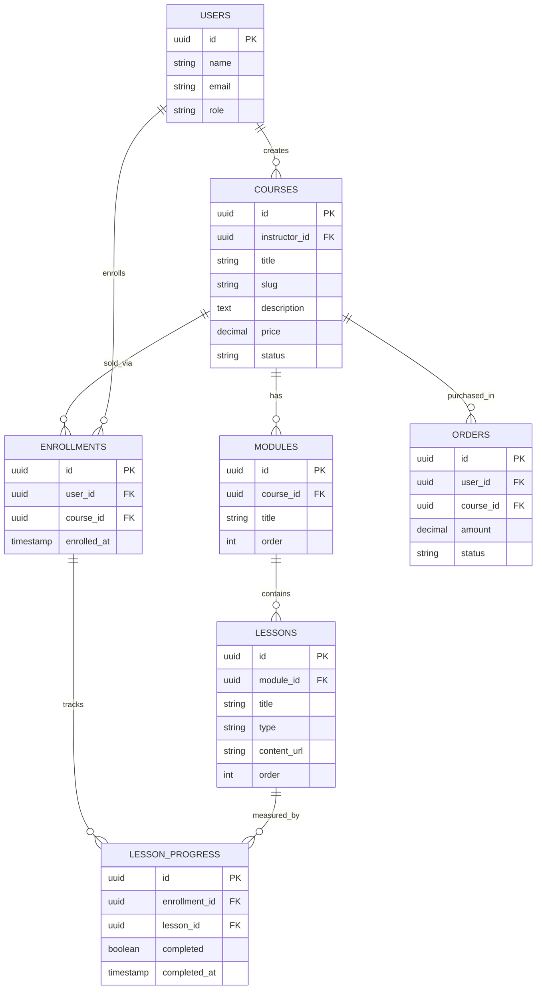

# 05 — LMS / Mini-Course Platform

Platform untuk trainer, edukator, dan kreator menjual kursus online (video + materi + kuis) dengan sistem pembayaran dan sertifikat. Fokus "course business" skala kecil-menengah.

---

## 1. Analisis Pasar

**Masalah yang dipecahkan**
- Kreator jual kursus lewat Google Drive + grup WA → tidak profesional, mudah dibajak.
- Sulit kelola akses, pembayaran, dan progres murid.
- Platform besar memotong komisi tinggi.

**Target user**
- Trainer, dosen, praktisi yang ingin jual ilmu.
- Bootcamp kecil, komunitas, coach.

**Ukuran pasar (Indonesia)**
- Edtech & creator economy tumbuh; banyak micro-educator.
- Permintaan upskilling tinggi (AI, digital, bahasa, skill kerja).

**Kompetitor**
- Udemy, Teachable, Thinkific, Kelas.work, Pijar.
- Celah: platform sendiri tanpa potongan besar, pembayaran lokal, harga terjangkau, fokus kreator individu.

**Diferensiasi**
- White-label ringan: domain & branding sendiri.
- Pembayaran lokal (QRIS, transfer, cicilan).
- Drip content + komunitas + sertifikat otomatis.

**Pricing**
- Free: 1 kursus, ≤50 murid, branding platform.
- Pro: Rp199 rb/bln (unlimited kursus, domain sendiri, sertifikat).
- Atau model komisi kecil per penjualan.

---

## 2. Fitur Lengkap

**MVP**
- Buat kursus: modul → pelajaran (video, teks, file).
- Halaman penjualan kursus + checkout.
- Enroll murid + akses materi terkunci.
- Pelacakan progres belajar.
- Pembayaran online.

**Lanjutan**
- Kuis & penilaian otomatis.
- Sertifikat penyelesaian (PDF).
- Drip content (rilis bertahap).
- Diskusi/komentar per pelajaran + komunitas.
- Kupon & affiliate.
- Analitik kursus (completion rate, revenue).

---

## 3. ERD / Database



---

## 4. Wireframe

**Halaman Kursus (Murid)**
```
+--------------------------------------------------------+
|  Belajar AI untuk Pemula                  Progres: 40% |
+----------------------------+---------------------------+
|  KURIKULUM                 |   [   VIDEO PLAYER     ]   |
|  Modul 1: Dasar AI         |                           |
|   ✔ Apa itu AI             |   Pelajaran 3:            |
|   ✔ Sejarah singkat        |   "Prompt Engineering"   |
|   ▶ Prompt Engineering     |                           |
|   ○ Studi kasus            |   [ Materi PDF ] [ Catatan]|
|  Modul 2: Praktik          |                           |
|   ○ Tools populer          |   [ Tandai Selesai → ]    |
+----------------------------+---------------------------+
```

**Halaman Penjualan**
```
+--------------------------------------------------------+
|  Belajar AI untuk Pemula                               |
|  oleh: Dr. Budi    ⭐ 4.8 (120)    320 murid           |
|  --------------------------------------------------    |
|  [ Preview video ]      Rp 299.000  ( ~~Rp499.000~~ )  |
|                         [   BELI SEKARANG   ]          |
|  Yang dipelajari: dasar AI, prompt, studi kasus...     |
+--------------------------------------------------------+
```

---

## 5. Prompt Coding

```text
Bangun platform LMS/mini-course dengan Next.js 14 + TypeScript + Tailwind + shadcn/ui,
backend Next.js API routes + PostgreSQL (Prisma), video via Mux/Cloudflare Stream,
pembayaran Midtrans.

Kebutuhan:
1. Skema DB sesuai ERD: users, courses, modules, lessons, enrollments,
   lesson_progress, orders.
2. Dashboard instruktur: buat kursus, susun modul & pelajaran (drag-and-drop urutan),
   upload video & file materi, set harga, publish.
3. Halaman penjualan publik /[slug]: deskripsi, kurikulum, preview, tombol beli.
4. Checkout via Midtrans; setelah bayar sukses (webhook) buat enrollment + order paid.
5. Area belajar murid: sidebar kurikulum, video player, tandai selesai, hitung progres.
   Materi terkunci untuk yang belum enroll.
6. Sertifikat PDF otomatis saat progres 100%.
7. Auth dengan peran instruktur & murid.

Berikan struktur folder, skema Prisma, integrasi video & pembayaran, dan logika
proteksi akses konten. UI berbahasa Indonesia.
```

---

## 6. Roadmap MVP

| Minggu | Fokus | Output |
|--------|-------|--------|
| 1 | Setup + Auth + skema DB | Repo, login, tabel siap |
| 2 | Builder kursus (modul/pelajaran) | Instruktur buat kursus + upload video |
| 3 | Halaman penjualan + checkout Midtrans | Murid bisa beli kursus |
| 4 | Area belajar + proteksi akses + progres | Murid belajar & progres tercatat |
| 5 | Sertifikat + analitik dasar | Sertifikat otomatis + statistik |
| 6 | Polish + pilot 3 instruktur | Feedback + landing page |

**Definisi selesai MVP:** instruktur bisa membuat & menjual kursus berbayar, murid membeli, mengakses video terkunci, dan progresnya terlacak.
