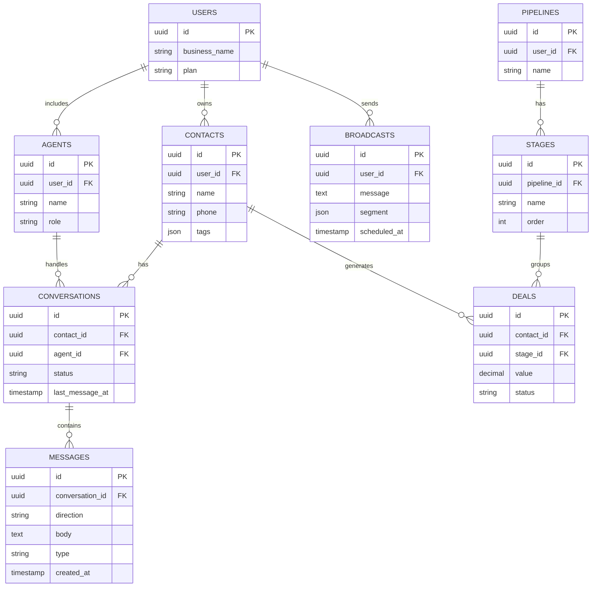

# 06 — CRM + Otomasi WhatsApp

CRM ringan yang berpusat pada WhatsApp: kelola leads, percakapan, follow-up otomatis, dan broadcast — dirancang untuk online shop dan tim sales UMKM yang berjualan via WA.

---

## 1. Analisis Pasar

**Masalah yang dipecahkan**
- Chat menumpuk di 1 nomor WA, leads bocor/terlupa.
- Tidak ada pipeline; follow-up tidak konsisten.
- Broadcast manual lambat & rawan diblokir.

**Target user**
- Online shop, reseller, tim sales UMKM, klinik, properti, otomotif.

**Ukuran pasar (Indonesia)**
- WhatsApp dominan untuk jualan & CS di Indonesia.
- Banyak bisnis kecil butuh kelola chat lebih rapi.

**Kompetitor**
- Qontak, Mekari Qontak, Barantum, OneTalk, WATI.
- Celah: harga lebih ramah UMKM, setup cepat, pipeline visual sederhana, AI auto-reply Indonesia.

**Diferensiasi**
- Pipeline drag-and-drop + inbox tim dalam 1 nomor.
- Balasan cepat (template) + auto-reply AI berbahasa Indonesia.
- Broadcast tersegmentasi + jadwal follow-up otomatis.

**Pricing**
- Starter: Rp149 rb/bln (1 nomor, 2 agen).
- Growth: Rp399 rb/bln (multi-agen, automation, broadcast).
- Per-seat add-on.

---

## 2. Fitur Lengkap

**MVP**
- Integrasi WhatsApp (WA Cloud API / penyedia gateway).
- Inbox bersama (shared inbox) multi-agen.
- Kontak & leads + label/tag.
- Pipeline penjualan (stage: baru → follow-up → closing → menang/kalah).
- Template balasan cepat.

**Lanjutan**
- Follow-up otomatis terjadwal (drip).
- Broadcast tersegmentasi + laporan terkirim/dibaca.
- Auto-reply / chatbot AI (FAQ, kualifikasi lead).
- Catatan & aktivitas per kontak.
- Integrasi katalog produk + order.
- Analitik respons & konversi.

---

## 3. ERD / Database



---

## 4. Wireframe

**Shared Inbox**
```
+--------------------------------------------------------+
|  Inbox WhatsApp                       Agen: Sari ▼      |
+----------------+---------------------------------------+
|  PERCAKAPAN    |  Andi (+62812...)        [Tag: Hot]   |
|  ● Andi  2m    |  --------------------------------------|
|    Budi  10m   |  Andi: Kak, ready stok yg merah?      |
|    Citra 1j    |  Anda: Ready kak! Mau ukuran berapa?  |
|    Dewi  3j    |                                        |
|                |  [ Template ▼ ] [ ✨ AI Balas ]       |
|                |  [ Ketik pesan...            ] [Kirim]|
+----------------+---------------------------------------+
```

**Pipeline (Kanban)**
```
+--------------------------------------------------------+
|  Pipeline Penjualan                                    |
|  BARU(8)     FOLLOW-UP(5)   CLOSING(3)    MENANG(12)   |
|  +--------+  +---------+    +---------+   +---------+   |
|  |Andi 1jt|  |Budi 2jt |    |Citra 5jt|   |Dewi 3jt |   |
|  +--------+  +---------+    +---------+   +---------+   |
|  |Eko 800k|  |Fani 1.5 |    |         |   |Gita 2jt |   |
|  +--------+  +---------+    +---------+   +---------+   |
+--------------------------------------------------------+
```

---

## 5. Prompt Coding

```text
Bangun CRM berbasis WhatsApp dengan Next.js 14 + TypeScript + Tailwind + shadcn/ui,
backend NestJS atau Next.js API + PostgreSQL (Prisma), realtime via WebSocket/Pusher,
integrasi WhatsApp Cloud API (Meta), worker BullMQ + Redis untuk broadcast & follow-up.

Kebutuhan:
1. Skema DB sesuai ERD: users, agents, contacts, conversations, messages, pipelines,
   stages, deals, broadcasts.
2. Webhook WhatsApp Cloud API: terima pesan masuk → buat/upyari conversation + message,
   tampilkan realtime di shared inbox. Kirim pesan keluar via API.
3. Shared inbox multi-agen: assignment percakapan, status (open/pending/closed),
   template balasan cepat.
4. Tombol "AI Balas": panggil LLM untuk menyarankan balasan berbahasa Indonesia
   berdasarkan konteks percakapan + info produk.
5. Pipeline Kanban drag-and-drop: deals berpindah stage, nilai deal, status menang/kalah.
6. Broadcast tersegmentasi (by tag) terjadwal via worker, dengan throttling agar aman.
7. Follow-up otomatis (drip) berdasarkan stage/tag.

Berikan struktur folder, skema Prisma, handler webhook, setup realtime & queue.
UI berbahasa Indonesia.
```

---

## 6. Roadmap MVP

| Minggu | Fokus | Output |
|--------|-------|--------|
| 1 | Setup + Auth + skema DB | Repo, login, tabel siap |
| 2 | Integrasi WA Cloud API + webhook | Terima & kirim pesan |
| 3 | Shared inbox realtime + kontak/tag | Tim balas chat dari 1 nomor |
| 4 | Pipeline Kanban + deals | Kelola leads visual |
| 5 | Broadcast + follow-up otomatis | Kirim massal + drip |
| 6 | AI balas + analitik + pilot | Pilot 3 online shop |

**Definisi selesai MVP:** tim bisa menerima & membalas chat WhatsApp dari satu inbox bersama, mengelola leads di pipeline, dan mengirim broadcast tersegmentasi.
