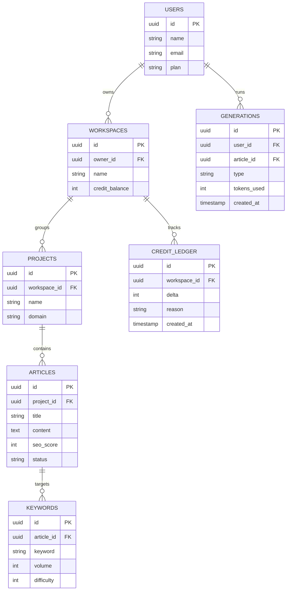

# 07 — SEO Content Generator (SaaS)

SaaS berbasis AI untuk riset kata kunci, pembuatan outline, dan penulisan artikel SEO yang siap terbit — untuk agensi, blogger, dan tim marketing yang butuh konten berkualitas dalam skala besar.

---

## 1. Analisis Pasar

**Masalah yang dipecahkan**
- Menulis artikel SEO lama & mahal (riset keyword + draft + optimasi).
- Konsistensi kualitas & struktur SEO sulit dijaga.
- Tim kecil tidak sanggup produksi konten dalam volume.

**Target user**
- Agensi digital marketing, content writer, blogger, tim SEO in-house, pemilik website afiliasi.

**Ukuran pasar (Indonesia & global)**
- Permintaan konten SEO terus naik; AI writing jadi kategori panas.
- Banyak agensi lokal cari tools berbahasa Indonesia + harga Rupiah.

**Kompetitor**
- Jasper, Copy.ai, Writesonic, SurferSEO, Frase, Scalenut.
- Celah: dukungan **konten berbahasa Indonesia berkualitas**, harga lokal, alur kerja keyword→outline→artikel yang ringkas.

**Diferensiasi**
- Optimasi SEO terintegrasi (skor, NLP terms, internal link).
- Mode Bahasa Indonesia yang natural (bukan terjemahan kaku).
- Workflow tim + bulk generation.

**Pricing (berbasis kredit/kata)**
- Starter: Rp149 rb/bln (~25 rb kata).
- Pro: Rp449 rb/bln (~100 rb kata + SEO mode).
- Agency: Rp1,2 jt/bln (tim, bulk, klien).

---

## 2. Fitur Lengkap

**MVP**
- Riset kata kunci (volume, kesulitan, ide turunan).
- Generator outline artikel dari keyword.
- Penulis artikel AI (intro, heading, paragraf, kesimpulan).
- Editor dengan skor SEO real-time.
- Ekspor (Markdown/HTML/WordPress).

**Lanjutan**
- Bulk generation (banyak artikel sekaligus).
- Analisis SERP & saran NLP terms.
- Internal linking otomatis.
- Brand voice / template kustom.
- Integrasi WordPress (publish langsung).
- Kolaborasi tim + manajemen kredit per workspace.

---

## 3. ERD / Database



---

## 4. Wireframe

**Editor Artikel + Skor SEO**
```
+--------------------------------------------------------+
|  Artikel: "Panduan Memilih Laptop 2026"   Skor SEO: 82 |
+----------------------------------+---------------------+
|  H1: Panduan Memilih Laptop 2026 |  SEO CHECKLIST      |
|                                  |  ✔ Keyword di judul |
|  ## Faktor Penting               |  ✔ Panjang 1500+    |
|  Saat memilih laptop...          |  ⚠ Tambah 2 subjudul|
|  [ ✨ Lanjutkan tulisan AI ]     |  ⚠ Kurang internal  |
|                                  |    link             |
|  ## Rekomendasi                  |  TERMS (NLP):       |
|  ...                             |  prosesor, RAM, SSD |
+----------------------------------+---------------------+
|  [ Ekspor: Markdown | HTML | WordPress ]   Kredit: 18k |
+--------------------------------------------------------+
```

**Wizard Buat Artikel**
```
+--------------------------------------------------------+
|  Buat Artikel Baru                                     |
|  1) Kata kunci utama: [ laptop terbaik 2026     ]      |
|     Volume: 8.100   Kesulitan: 34                      |
|  2) [ ✨ Generate Outline ]                            |
|     - Pendahuluan                                      |
|     - Faktor penting                                   |
|     - 10 rekomendasi                                   |
|  3) [   GENERATE ARTIKEL LENGKAP   ]                   |
+--------------------------------------------------------+
```

---

## 5. Prompt Coding

```text
Bangun SaaS SEO content generator dengan Next.js 14 + TypeScript + Tailwind + shadcn/ui,
backend Next.js API routes + PostgreSQL (Prisma), AI via OpenAI/Anthropic, editor rich
text (TipTap), pembayaran langganan via Midtrans/Stripe + sistem kredit.

Kebutuhan:
1. Skema DB sesuai ERD: users, workspaces, projects, articles, keywords, generations,
   credit_ledger. Setiap generation mengurangi credit_balance (catat di credit_ledger).
2. Wizard buat artikel: input keyword → tampilkan data keyword (boleh mock/3rd-party API)
   → generate outline → generate artikel lengkap (streaming).
3. Editor TipTap dengan panel skor SEO real-time: cek keyword di judul/H1, panjang,
   jumlah subjudul, kepadatan keyword, saran NLP terms, internal link.
4. Tombol AI: lanjutkan tulisan, parafrase, ringkas, ubah nada. Mode Bahasa Indonesia
   yang natural.
5. Ekspor ke Markdown/HTML dan publish ke WordPress via REST API.
6. Manajemen workspace + kredit + langganan (paywall berbasis plan).
7. Bulk generation (antrian) untuk banyak keyword sekaligus.

Berikan struktur folder, skema Prisma, endpoint streaming AI, komponen editor, dan
logika kredit. UI berbahasa Indonesia.
```

---

## 6. Roadmap MVP

| Minggu | Fokus | Output |
|--------|-------|--------|
| 1 | Setup + Auth + skema DB + kredit | Repo, login, sistem kredit |
| 2 | Keyword input + generate outline | Wizard tahap 1-2 |
| 3 | Generate artikel (streaming) + editor | Artikel AI di editor |
| 4 | Skor SEO real-time | Panel optimasi |
| 5 | Ekspor + langganan/paywall | Monetisasi aktif |
| 6 | Bulk + polish + pilot agensi | Pilot 3 agensi + landing page |

**Definisi selesai MVP:** user memasukkan keyword, mendapat outline, lalu artikel SEO berbahasa Indonesia yang bisa diedit dengan skor SEO dan diekspor — dengan kredit yang terpotong sesuai plan.
