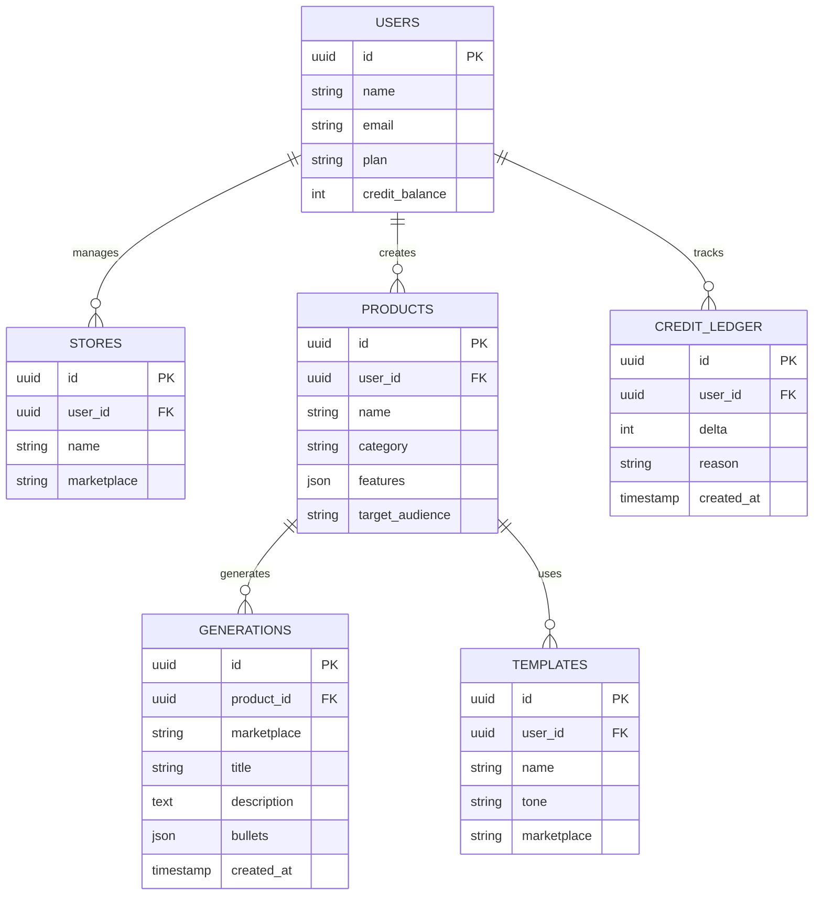

# 08 — Generator Deskripsi Produk Marketplace

Alat AI untuk seller Shopee, Tokopedia, TikTok Shop, dan Lazada membuat judul, deskripsi, dan bullet point produk yang SEO-friendly dan menjual — dalam hitungan detik, massal.

---

## 1. Analisis Pasar

**Masalah yang dipecahkan**
- Menulis deskripsi produk satu per satu sangat memakan waktu.
- Judul tidak optimal untuk pencarian marketplace → produk tidak ditemukan.
- Seller pemula bingung menulis copy yang menjual.

**Target user**
- Seller marketplace (Shopee, Tokopedia, TikTok Shop, Lazada), dropshipper, brand UMKM, agensi pengelola toko.

**Ukuran pasar (Indonesia)**
- Jutaan seller aktif di marketplace; turnover produk tinggi.
- Persaingan ketat → optimasi listing krusial.

**Kompetitor**
- Copy.ai/Jasper (umum), beberapa tools lokal kecil.
- Celah: fokus **format marketplace Indonesia** (judul ber-keyword, batas karakter, gaya bahasa lokal), bulk + impor CSV.

**Diferensiasi**
- Template per-marketplace (aturan judul & karakter berbeda).
- Bulk generate via upload CSV/foto.
- Riset keyword pencarian marketplace + variasi A/B.

**Pricing (freemium + kredit)**
- Free: 5 produk/bln.
- Pro: Rp99 rb/bln (200 produk + bulk).
- Pay-as-you-go kredit untuk volume besar.

---

## 2. Fitur Lengkap

**MVP**
- Input detail produk (nama, kategori, fitur, target).
- Generate judul + deskripsi + bullet points (gaya menjual, SEO).
- Pilih marketplace (atur format & batas karakter).
- Riwayat & simpan hasil.
- Copy/ekspor cepat.

**Lanjutan**
- Bulk generate via upload CSV.
- Generate dari foto produk (vision → atribut).
- Riset keyword marketplace + skor optimasi.
- Variasi A/B judul.
- Multi-bahasa (ID/EN).
- Brand voice tersimpan + integrasi API toko.

---

## 3. ERD / Database



---

## 4. Wireframe

**Generator Tunggal**
```
+--------------------------------------------------------+
|  Generator Deskripsi Produk                            |
+----------------------------+---------------------------+
|  Nama: [ Sepatu Lari Pria ]|   HASIL                   |
|  Kategori: [ Olahraga ]    |   Judul (Shopee):         |
|  Fitur:                    |   "Sepatu Lari Pria Anti  |
|   - ringan, anti slip      |    Slip Ringan Original   |
|   - bahan breathable       |    Premium Running Shoes" |
|  Target: [ pria 18-35 ]    |                           |
|  Marketplace:[ Shopee v ]  |   Deskripsi:              |
|  Nada: [ Persuasif v ]     |   "Tampil maksimal saat.. |
|                            |   ✓ Ringan & nyaman       |
|  [   ✨ GENERATE   ]       |   ✓ Anti slip..."         |
|                            |   [ Salin ] [ Simpan ]    |
+----------------------------+---------------------------+
```

**Bulk (CSV)**
```
+--------------------------------------------------------+
|  Bulk Generate                                         |
|  [ Upload CSV produk ]   (kolom: nama, kategori, fitur)|
|  --------------------------------------------------    |
|  20 produk terdeteksi   Estimasi kredit: 20            |
|  [   GENERATE SEMUA   ]      [ Unduh hasil CSV ]       |
+--------------------------------------------------------+
```

---

## 5. Prompt Coding

```text
Bangun aplikasi AI generator deskripsi produk marketplace dengan Next.js 14 + TypeScript
+ Tailwind + shadcn/ui, backend Next.js API routes + PostgreSQL (Prisma), AI via
OpenAI/Anthropic (termasuk vision untuk input foto), sistem kredit + langganan Midtrans.

Kebutuhan:
1. Skema DB sesuai ERD: users, stores, products, generations, templates, credit_ledger.
2. Form generator: input nama, kategori, fitur (list), target audience, pilih marketplace
   (Shopee/Tokopedia/TikTok Shop/Lazada) dan nada bahasa. Setiap marketplace punya aturan
   judul (panjang & gaya) berbeda — encode sebagai prompt template.
3. Generate judul SEO marketplace, deskripsi persuasif, dan bullet points. Streaming hasil.
   Kurangi kredit & catat di credit_ledger.
4. Bulk generate: upload CSV (nama, kategori, fitur), proses antrian (BullMQ), hasil bisa
   diunduh sebagai CSV.
5. Generate dari foto: upload gambar → vision model ekstrak atribut → isi form otomatis.
6. Riwayat generation + simpan template brand voice.
7. Paywall berbasis plan + pembelian kredit.

Berikan struktur folder, skema Prisma, prompt template per-marketplace, endpoint streaming,
dan alur bulk CSV. UI berbahasa Indonesia.
```

---

## 6. Roadmap MVP

| Minggu | Fokus | Output |
|--------|-------|--------|
| 1 | Setup + Auth + skema DB + kredit | Repo, login, sistem kredit |
| 2 | Generator tunggal + template marketplace | Hasil judul/deskripsi/bullet |
| 3 | Riwayat + simpan + copy/ekspor | Kelola hasil |
| 4 | Bulk generate via CSV | Volume besar |
| 5 | Input foto (vision) + paywall | Fitur premium + monetisasi |
| 6 | Polish + pilot 5 seller | Feedback + landing page |

**Definisi selesai MVP:** seller memasukkan detail produk, memilih marketplace, dan langsung mendapat judul SEO + deskripsi + bullet points siap-tempel, dengan opsi bulk via CSV.
