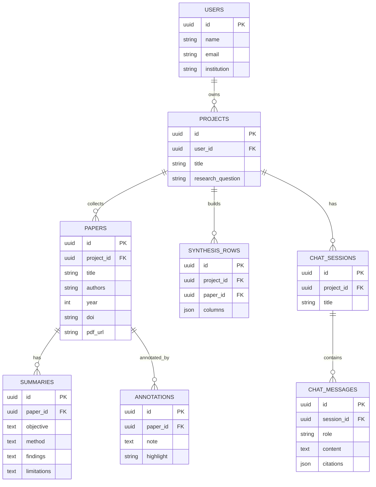

# 09 — Asisten Riset Akademik (Literature Review)

Asisten berbasis AI untuk dosen dan mahasiswa S2/S3: mencari, meringkas, dan mengorganisir literatur, membangun matriks sintesis, serta membantu menyusun tinjauan pustaka dengan sitasi rapi.

---

## 1. Analisis Pasar

**Masalah yang dipecahkan**
- Tinjauan pustaka makan waktu berbulan-bulan (cari, baca, ringkas, sintesis).
- Sulit melacak ratusan paper & mengelola sitasi.
- Mahasiswa kewalahan menemukan "gap" penelitian.

**Target user**
- Mahasiswa S2/S3, dosen, peneliti, kelompok riset kampus.

**Ukuran pasar (Indonesia)**
- Ratusan ribu mahasiswa pascasarjana + dosen yang wajib publikasi.
- Tekanan publikasi (Scopus/SINTA) tinggi → kebutuhan tools nyata.

**Kompetitor**
- Elicit, Research Rabbit, Scite, Consensus, SciSpace, Zotero (referensi).
- Celah: alur kerja **end-to-end berbahasa Indonesia**, integrasi gaya sitasi lokal, harga akademik terjangkau, fitur sintesis matriks.

**Diferensiasi**
- Workspace per-proyek riset: dari pencarian → matriks sintesis → draft.
- Ringkasan & tanya-jawab terhadap PDF (grounded, dengan sitasi).
- Ekspor sitasi (APA/IEEE) + integrasi Zotero/Mendeley.

**Pricing**
- Free: 1 proyek, ≤20 paper.
- Student: Rp59 rb/bln.
- Pro/Lab: Rp199 rb/bln (multi-proyek, kolaborasi, ekspor lanjutan).

---

## 2. Fitur Lengkap

**MVP**
- Pencarian paper (via API: Semantic Scholar/OpenAlex/Crossref).
- Simpan ke perpustakaan proyek + metadata sitasi.
- Upload PDF + ringkasan otomatis (tujuan, metode, temuan).
- Tanya-jawab terhadap kumpulan paper (RAG, dengan kutipan).
- Ekspor daftar pustaka (APA/IEEE/BibTeX).

**Lanjutan**
- Matriks sintesis (tabel: penulis, metode, temuan, gap).
- Deteksi tema & klaster topik.
- Saran "research gap".
- Anotasi & highlight kolaboratif.
- Draft bagian tinjauan pustaka berbasis matriks.
- Integrasi Zotero/Mendeley.

---

## 3. ERD / Database



---

## 4. Wireframe

**Workspace Proyek Riset**
```
+--------------------------------------------------------+
|  Proyek: "EWS Gempa Berbasis Deep Learning"            |
+----------------+---------------------------------------+
|  PUSTAKA (42)  |   TANYA PUSTAKA                        |
|  □ Zhang 2023  |   Q: Metode apa yang paling akurat?   |
|  □ Sari 2022   |   --------------------------------------|
|  □ Lee 2024    |   A: Berdasarkan 5 paper, CNN-LSTM     |
|  [+ Cari paper]|      unggul [Zhang 2023], namun GNN   |
|                |      lebih cepat [Lee 2024]...        |
|  [Matriks ▦]   |      Sumber: [1][2][3]                |
|  [Ekspor sitasi]|  [ Ketik pertanyaan...        ] [→]  |
+----------------+---------------------------------------+
```

**Matriks Sintesis**
```
+--------------------------------------------------------+
|  Matriks Sintesis                       [+ Kolom]      |
|  Penulis    | Tahun | Metode    | Temuan    | Gap      |
|  Zhang      | 2023  | CNN-LSTM  | Akurasi95 | data IDN |
|  Sari       | 2022  | SVM       | Akurasi82 | realtime |
|  Lee        | 2024  | GNN       | Cepat     | dataset  |
|  [ ✨ Isi otomatis dari ringkasan ]  [ Ekspor Excel ]  |
+--------------------------------------------------------+
```

---

## 5. Prompt Coding

```text
Bangun asisten riset akademik (literature review) dengan Next.js 14 + TypeScript +
Tailwind + shadcn/ui, backend Next.js API routes + PostgreSQL (Prisma) + pgvector untuk
RAG, AI via OpenAI/Anthropic, parsing PDF (pdf-parse/unstructured).

Kebutuhan:
1. Skema DB sesuai ERD: users, projects, papers, summaries, annotations,
   synthesis_rows, chat_sessions, chat_messages. Aktifkan pgvector untuk embedding.
2. Pencarian paper via API publik (Semantic Scholar/OpenAlex/Crossref): tampilkan hasil,
   simpan ke pustaka proyek dengan metadata sitasi.
3. Upload PDF → ekstrak teks → chunk + embedding ke pgvector. Generate ringkasan
   terstruktur (tujuan, metode, temuan, keterbatasan).
4. Chat "Tanya Pustaka" (RAG): jawab pertanyaan berdasar paper dalam proyek, sertakan
   kutipan/sumber yang dapat diklik. Hindari halusinasi (grounded + tampilkan sumber).
5. Matriks sintesis: tabel paper x kolom (metode, temuan, gap), dengan tombol "isi
   otomatis dari ringkasan". Ekspor Excel.
6. Ekspor daftar pustaka APA/IEEE/BibTeX.
7. Multi-proyek + auth.

Berikan struktur folder, skema Prisma + setup pgvector, pipeline ingest PDF, endpoint RAG
dengan sitasi, dan komponen matriks. UI berbahasa Indonesia.
```

---

## 6. Roadmap MVP

| Minggu | Fokus | Output |
|--------|-------|--------|
| 1 | Setup + Auth + skema DB + pgvector | Repo, login, vektor siap |
| 2 | Pencarian paper + pustaka proyek | Cari & simpan paper |
| 3 | Upload PDF + ringkasan terstruktur | Ringkasan otomatis |
| 4 | RAG "Tanya Pustaka" + sitasi | Tanya-jawab grounded |
| 5 | Matriks sintesis + ekspor sitasi | Sintesis & daftar pustaka |
| 6 | Polish + pilot 5 mahasiswa S2/S3 | Feedback + landing page |

**Definisi selesai MVP:** peneliti bisa mengumpulkan paper, mendapatkan ringkasan terstruktur, bertanya ke kumpulan literatur dengan jawaban bersitasi, dan mengekspor daftar pustaka.
