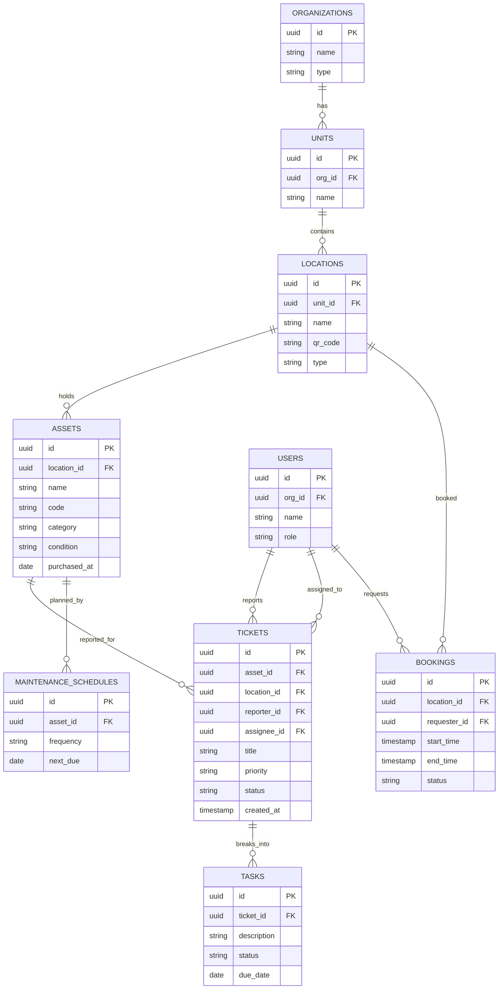

# 10 — FSM Kampus SaaS (Facility Service Management)

Platform B2B untuk kampus, sekolah, dan pengelola gedung: tiket pemeliharaan, manajemen aset, booking ruang/lab, dan manajemen tugas dalam satu superapp. Lanjutan komersial dari dokumen `fsm-superapp/` di repo ini.

> Referensi internal: lihat `fsm-superapp/00-overview.md` s.d. `05-roadmap-next-steps.md`.

---

## 1. Analisis Pasar

**Masalah yang dipecahkan**
- Laporan kerusakan fasilitas via WA/lisan → tidak terlacak, lambat ditangani.
- Aset (proyektor, AC, alat lab) tidak terdata, sulit dipelihara & sering hilang.
- Booking ruang/lab bentrok, proses manual.
- Tidak ada data untuk perencanaan anggaran pemeliharaan.

**Target user**
- Fakultas/universitas, sekolah, pengelola gedung, rumah sakit, instansi pemerintah.
- Pembeli: bagian umum/sarpras, BAU, manajemen fasilitas.

**Ukuran pasar (Indonesia)**
- Ribuan kampus & sekolah + gedung perkantoran/pemerintah.
- Tiket besar (B2B), siklus pembelian institusional, retensi tinggi.

**Kompetitor**
- UpKeep, Limble, Fiix, MaintainX, Infraspeak (CMMS global).
- Celah: harga & implementasi lokal, bahasa Indonesia, modul booking ruang/lab khas kampus, dukungan on-prem/cloud, integrasi SSO kampus.

**Diferensiasi**
- Superapp: tiket + aset + booking + tugas dalam satu sistem.
- Disesuaikan konteks kampus (lab, ruang kelas, jadwal akademik).
- QR code per aset/ruang untuk lapor & booking instan.

**Pricing (B2B)**
- Lisensi per institusi berdasar jumlah aset/pengguna.
- Tier: Basic (1 unit/fakultas), Pro (multi-unit), Enterprise (kampus penuh + SSO + on-prem).
- Biaya implementasi & pelatihan satu kali.

---

## 2. Fitur Lengkap

**MVP**
- Tiket pemeliharaan: lapor (foto + lokasi via QR) → assign teknisi → status → selesai.
- Registry aset: data aset, lokasi, kondisi, QR code.
- Booking ruang/lab: lihat ketersediaan → ajukan → approval.
- Manajemen tugas teknisi (to-do, prioritas, due date).
- Dashboard & notifikasi.

**Lanjutan**
- Pemeliharaan preventif terjadwal (PM schedule).
- SLA & eskalasi otomatis.
- Manajemen vendor & suku cadang/inventory.
- Pelaporan & analitik (downtime, biaya, beban kerja).
- Peran & multi-unit/fakultas + SSO kampus.
- Mobile app teknisi + mode offline.
- Integrasi IoT (sensor) — lihat `doc_spec_fsm_superapp/03-smart-faculty-ai-iot.md`.

---

## 3. ERD / Database



---

## 4. Wireframe

**Dashboard Sarpras**
```
+--------------------------------------------------------+
|  FSM Kampus — Dashboard            Unit: FSM Undip ▼    |
+--------------------------------------------------------+
|  Tiket Aktif: 14   Selesai (bln): 86   Aset: 1.240     |
|  Booking hari ini: 9    PM jatuh tempo: 5              |
|  --------------------------------------------------    |
|  Tiket Prioritas Tinggi                                |
|  #231 AC R.301 mati        [Tinggi]  → Teknisi: Budi   |
|  #229 Proyektor Lab 2 rusak[Sedang]  → Belum di-assign |
|  [ Lihat semua tiket ]                                 |
+--------------------------------------------------------+
```

**Lapor via QR (Mobile)**
```
+----------------------------+
|  Lapor Kerusakan           |
|  Lokasi: R.301 (via QR)    |
|  Aset:  AC Daikin #A-0457  |
|  Masalah:                  |
|  [ AC tidak dingin...    ] |
|  [ 📷 Tambah Foto ]        |
|  Prioritas: ( ) Rendah     |
|             (•) Sedang     |
|             ( ) Tinggi     |
|  [     KIRIM LAPORAN     ] |
+----------------------------+
```

---

## 5. Prompt Coding

```text
Bangun platform FSM (Facility Service Management) untuk kampus dengan Next.js 14 +
TypeScript + Tailwind + shadcn/ui (web admin) dan PWA mobile untuk teknisi/pelapor,
backend NestJS + PostgreSQL (Prisma), realtime via WebSocket, auth SSO (SAML/OIDC) +
role-based access.

Kebutuhan:
1. Skema DB sesuai ERD: organizations, units, locations, assets, users, tickets, tasks,
   bookings, maintenance_schedules. Multi-tenant (per organization).
2. Modul Tiket: lapor kerusakan (scan QR lokasi/aset → prefilled), upload foto, set
   prioritas; alur status (baru → assigned → in-progress → selesai); assign teknisi;
   notifikasi realtime; SLA & eskalasi.
3. Modul Aset: CRUD aset, generate QR code per aset & lokasi, riwayat pemeliharaan,
   jadwal preventive maintenance (buat tiket otomatis saat jatuh tempo).
4. Modul Booking ruang/lab: kalender ketersediaan, ajukan booking, approval, cegah bentrok.
5. Modul Tugas: pecah tiket jadi tasks, papan kanban teknisi, due date.
6. Dashboard & laporan: tiket aktif, downtime, beban kerja teknisi, biaya; ekspor PDF/Excel.
7. RBAC: admin sarpras, teknisi, dosen/staf pelapor, pimpinan; multi-unit/fakultas.

Berikan struktur folder monorepo (web + api + mobile PWA), skema Prisma multi-tenant,
generator QR, mesin SLA/eskalasi, dan integrasi SSO. UI berbahasa Indonesia.
```

---

## 6. Roadmap MVP

| Minggu | Fokus | Output |
|--------|-------|--------|
| 1 | Setup monorepo + Auth/RBAC + skema multi-tenant | Repo, login, tenant siap |
| 2 | Registry aset + QR code + lokasi | Data aset + QR |
| 3 | Modul tiket (lapor via QR → assign → selesai) | Alur tiket end-to-end |
| 4 | Booking ruang/lab + anti-bentrok | Booking + approval |
| 5 | Tugas teknisi + dashboard + notifikasi | Operasional harian |
| 6 | PM terjadwal + laporan + pilot 1 fakultas | Pilot nyata + materi penjualan |

**Definisi selesai MVP:** sebuah fakultas bisa mendata aset (ber-QR), menerima laporan kerusakan via scan QR, menugaskan teknisi sampai selesai, dan mengelola booking ruang/lab tanpa bentrok — semua terpantau di dashboard.
